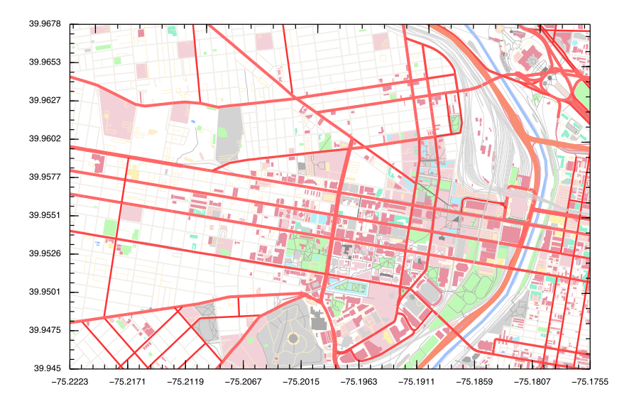

# OpenStreetMapParser2.jl
## About
This package was born because I tried to use Julia's [OpenStreetMap.jl](https://github.com/tedsteiner/OpenStreetMap.jl) library, and it does not work in Julia 1.0, which is the latest release. In addition, it did not have quite a few features which I thought were important.
To remedy this, I decided to make my own OpenStreetMap library which had features that I thought important.

## Features
It can parse OpenStreetMap maps from either a bounding box (which then fetches the map from the [Overpass API](https://wiki.openstreetmap.org/wiki/Overpass_API)) or from a .osm file. 
It uses three functions to create arrays of either the nodes, the ways, or the relations in the map. These are defined by structs in the library, and have all the attributes that OSM objects do, just in an easier format to work with in Julia.
In addition, it has a plotting function which uses [Winston.jl](https://github.com/JuliaGraphics/Winston.jl) to create beautiful renderings of the maps. 

The main ways in which this package is better than OpenStreetMap.jl:
* The graphing function is able to draw buildings and other OSM objects like parks, rivers, etc, as polygons rather than just as outlines.
* Because this package is primarily focused on extracting data from the OSM objects, rather than on geometry, the structs are much easier to understand because everything is in WGS84 projection. 

The styling for all the different object types is defined in styles.jl, which is composed of a few dictionaries that map OSM tags to Style objects. These dicts are accessible to the user, so you can easily change the styling as you wish.


## Example
```julia
#open a file from bounding box...
julia> bbox = (-75.2262,39.9365,-75.1327, 39.9821)
julia> xml = open_bbox(bbox)
#or from a file
julia> xml, bbox = open_file("map2.osm")

#parse the ways
julia> way_arr = parse_ways(xml)

#plot it
julia> plot_ways(way_arr, bbox)
```

